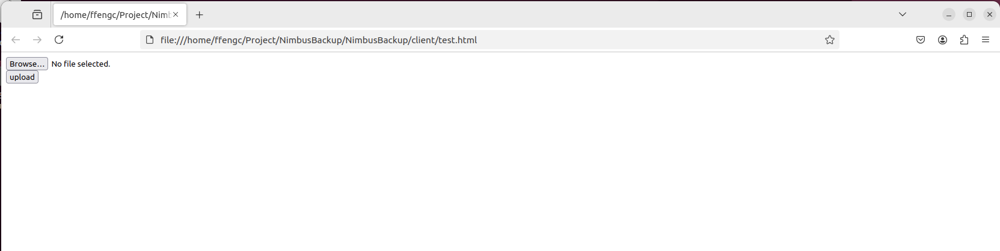

# 系统搭建详细过程

## 客户端和服务端模块划分

**客户端**
- 数据管理模块：负责客户端备份的文件信息管理，通过这些数据可以确定一个文件是否需要备份 (新增/已备份但被修改)。
- 文件检测模块：遍历获取指定文件夹中所有文件路径名称。
- 网络通信模块：搭建网络通信客户端，实现将文件数据备份上传到服务器

**服务端**
- 数据管理模块：负责服务器上备份文件的信息管理。
- 网络通信模块：搭建网络通信服务器，实现与客户端通信。
- 业务处理模块：针对客户端的各个请求进行对应业务处理并响应结果。
- 热点管理模块：负责文件的热点判断，以及非热点文件的压缩存储

## 环境搭建

**升级gcc到7.3版本**
> 我使用的gcc版本: `gcc version 11.4.0 (Ubuntu 11.4.0-1ubuntu1~22.04)`

**安装 `jsoncpp`**

> 略

> [!TIP]
> 对于数据压缩部分, 我尝试在arm架构Ubuntu上使用bundle库, 但结果是无法运行, 因为指令集不同。\
> 因此在arm架构Ubuntu上, 我是用zlib进行数据压缩。

**下载 `bundle` 数据压缩库 (x86_64架构)**

> github下载即可, 只需要用头文件 \
> [https://github.com/r-lyeh-archived/bundle](https://github.com/r-lyeh-archived/bundle)

**下载 `zlib` 库 (arm架构)**

> 略, 一般来说默认都会有的, 如果没有, 可以查阅资料下载, 非常简单

**下载 `httplib` 库**

> github下载即可, 只需要用头文件 \
> [https://github.com/yhirose/cpp-httplib](https://github.com/yhirose/cpp-httplib)

**安装ctemplate前端渲染库**

> 待完善

## 数据压缩

### 使用bundle (x86_64架构)

BundleBundle 是一个嵌入式压缩库，支持23种压缩算法和2种存档格式。使用的时候只需要加入两个文件 `bundle.h` 和 `bundle.cpp` 即可。

- 使用的详细文档: [https://github.com/r-lyeh-archived/bundle/blob/master/README.md](https://github.com/r-lyeh-archived/bundle/blob/master/README.md)

使用示例代码如 [test_bundle.cc](../NimbusBackup/test/test_bundle.cc) 所示。

```cpp
#include "bundle.h"
#include <fstream>
#include <iostream>
#include <string>

int main(int argc, char** argv) {
    // argv[1]: 原始文件路径名称
    // argv[2]: 压缩包名称
    if (argc < 3)
        return -1;
    std::string ifilename = argv[1];
    std::string ofilename = argv[2];

    // open the file and read the file
    std::ifstream ifs;
    ifs.open(ifilename, std::ios::binary);
    ifs.seekg(0, std::ios::end);
    size_t fsize = ifs.tellg(); // size of the file
    ifs.seekg(0, std::ios::beg);
    std::string body;
    body.resize(fsize);
    ifs.read(&body[0], fsize); // read the file

    // compress the file
    std::string packed = bundle::pack(bundle::LZIP, body);

    // make output file
    std::ofstream ofs;
    ofs.open(ofilename, std::ios::binary);
    ofs.write(&packed[0], packed.size());

    ifs.close();
    ofs.close();
    return 0;
}
```

### 使用zlib (arm架构)

使用示例代码如 [test_zlib.cc](../NimbusBackup/test/test_zlib.cc) 所示。

```cpp
#include <fstream>
#include <iostream>
#include <stdexcept>
#include <vector>
#include <zlib.h>

std::string compressString(const std::string& str, int compressionLevel = Z_DEFAULT_COMPRESSION) {
    if (str.empty()) {
        return "";
    }
    // 估算压缩后数据的最大大小
    uLongf compressedSize = compressBound(str.size());
    std::vector<Bytef> compressedData(compressedSize);
    // 执行压缩
    int res = compress2(compressedData.data(), &compressedSize, reinterpret_cast<const Bytef*>(str.data()), str.size(), compressionLevel);
    if (res != Z_OK) {
        throw std::runtime_error("压缩失败，错误码: " + std::to_string(res));
    }
    // 将压缩数据转换为字符串
    return std::string(reinterpret_cast<char*>(compressedData.data()), compressedSize);
}

// 解压缩字符串
std::string decompressString(const std::string& str) {
    if (str.empty()) {
        return "";
    }
    // 设定一个初始的解压缓冲区大小（可以根据需要调整）
    uLongf decompressedSize = str.size() * 4; // 初始估计值
    std::vector<char> decompressedData(decompressedSize);
    int res = uncompress(reinterpret_cast<Bytef*>(decompressedData.data()), &decompressedSize, reinterpret_cast<const Bytef*>(str.data()), str.size());
    // 如果缓冲区不够大，循环增加缓冲区大小
    while (res == Z_BUF_ERROR) {
        decompressedSize *= 2;
        decompressedData.resize(decompressedSize);
        res = uncompress(reinterpret_cast<Bytef*>(decompressedData.data()), &decompressedSize, reinterpret_cast<const Bytef*>(str.data()), str.size());
    }
    if (res != Z_OK) {
        throw std::runtime_error("解压缩失败，错误码: " + std::to_string(res));
    }
    // 将解压数据转换为字符串
    return std::string(decompressedData.data(), decompressedSize);
}

int main() {
    std::ifstream ifs;
    ifs.open("./bundle.cpp", std::ios::binary);
    ifs.seekg(0, std::ios::end);
    size_t fsize = ifs.tellg(); // size of the file
    ifs.seekg(0, std::ios::beg);
    std::string body;
    body.resize(fsize);
    ifs.read(&body[0], fsize); // read the file

    // compress the file
    auto packed = compressString(body);
    std::cout << "before packed: " << body.size() << std::endl;
    std::cout << "after packed: " << packed.size() << std::endl;

    auto unpacked = decompressString(packed);
    std::cout << "unpacked: " << unpacked.size() << std::endl;
    
    // output file
    std::ofstream ofs;
    ofs.open("unpacked_bundle.cpp", std::ios::binary);
    ofs.write(&unpacked[0], unpacked.size());
    ofs.close();
    ifs.close();
    return 0;
}
```

输出如下所示:

```bash
(base) ffengc@ubuntu-linux-22-04-desktop:~/Project/NimbusBackup/NimbusBackup/test$ ./test 
before packed: 5571471
after packed: 1052582
unpacked: 5571471
(base) ffengc@ubuntu-linux-22-04-desktop:~/Project/NimbusBackup/NimbusBackup/test$ 
```

### 在Linux或MacOS上使用md5工具判断两个文件是否完全相同

*Windows略*

输入以下命令计算文件的 MD5 值：

```sh
md5sum /path/file.txt # Linux
md5 /path/file.txt # macOS
```

判断两个文件的md5值是否一致即可。

当然, 也可以编写脚本批量判断。


## `httplib` 库认识

因为我在之前的项目中已经熟练使用这个库了, 因此部分略。


## 文件工具类设计

需要实现的功能: 
- 获取文件的大小
- 获取文件最后一次修改时间
- 获取文件最后一次访问时间
- 获取文件路径名中文件名称 (`/test/a.txt` -> `a.txt`)
- 向文件中写入数据
- 读取文件中的数据
- 获取文件指定位置, 指定长度的数据
- 遍历目录
- 判断文件是否存在
- 创建一个目录
- 压缩文件
- 解压缩文件

大部分接口都是非常简单了, 我这里只展示部分需要注意的接口。

### 目录相关操作

借助C++17的 [FileSystem](https://en.cppreference.com/w/cpp/experimental/fs)

[NimbusBackup/tools/util.hpp](NimbusBackup/tools/util.hpp)
```cpp
// 判断文件是否存在
bool exists() {
    namespace fs = std::experimental::filesystem;
    return fs::exists(__file_name);
}
// 创建目录
bool create_dir() {
    namespace fs = std::experimental::filesystem;
    if (this->exists())
        return true;
    return fs::create_directories(__file_name);
}
// 遍历目录
bool scan_dir(std::vector<std::string>* arry) {
    namespace fs = std::experimental::filesystem;
    for (auto& p : fs::directory_iterator(__file_name)) {
        if (fs::is_directory(p) == true)
            continue;
        // relative_path 是带有路径的文件名
        arry->push_back(fs::path(p).relative_path().string());
    }
    return true;
} //
```

## Json工具类实现

- 序列化
- 反序列化

两个接口即可。

[NimbusBackup/tools/util.hpp](NimbusBackup/tools/util.hpp)
```cpp
static bool serialize(const Json::Value& root, std::string* str) {
    Json::StreamWriterBuilder swb;
    std::unique_ptr<Json::StreamWriter> sw(swb.newStreamWriter());
    std::stringstream ss;
    if (sw->write(root, &ss) != 0) {
        LOG(ERROR) << "json write failed!" << std::endl;
        return false;
    }
    *str = ss.str();
    return true;
}
static bool unserialize(const std::string& str, Json::Value* root) {
    Json::CharReaderBuilder crb;
    std::unique_ptr<Json::CharReader> cr(crb.newCharReader());
    std::string err;
    bool ret = cr->parse(str.c_str(), str.c_str() + str.size(), root, &err);
    if (ret == false) {
        LOG(ERROR) << "json parse error: " << err << std::endl;
        return false;
    }
    return true;
}
```

## 用配置文件来配置系统信息

需要用配置文件来管理的信息:
- 热点判断时间
- 文件下载的url前缀路径, 比如 `/wwwroot`
  - 当用户发来一个备份列表查看请求, `show`, 我们要如何判断这是不是一个 `show` 的文件下载请求
  - 所以我们可以设置 `/download/show`, 来表示下载, 加上下载的前缀 `download`
- 服务端压缩包后缀名
- 上传文件的服务端存放路径
- 压缩包在服务端的存放路径
- 服务端备份信息的存放文件 (按照道理来说应该是用数据库, 但是本项目直接使用了文件)
- 服务器监听IP地址
- 服务器的监听端口

另外, 这个配置文件管理的模块, 应该要设计成单例。

[NimbusBackup/tools/config.hpp](NimbusBackup/tools/config.hpp)
```cpp
class Config {
#define CONFIG_FILE "../nimbus.conf" //
private:
    Config(const std::string& config_file = CONFIG_FILE) {
        LOG(INFO) << "load config: " << config_file << "..." << std::endl;
        __read_config_file(config_file);
    }
    static Config* __instance; // 单例指针
    static std::mutex __mutex; // 锁
private:
    // same with config
    int __hot_time;
    int __server_port;
    std::string __server_ip;
    std::string __download_prefix;
    std::string __packfile_suffix;
    std::string __pack_dir;
    std::string __back_dir;
    std::string __backup_file; //
private:
    bool __read_config_file(const std::string& config_file) {
        FileUtil fu(config_file);
        std::string body;
        if (!fu.access_content(&body)) {
            // 读取conf文件内容
            LOG(ERROR) << "load config file failed!" << std::endl;
            return false;
        }
        Json::Value root;
        if (!JsonUtil::unserialize(body, &root)) {
            LOG(ERROR) << "parse config file failed!" << std::endl;
            return false;
        }
        __hot_time = root["hot_time"].asInt();
        __server_port = root["server_port"].asInt();
        __server_ip = root["server_ip"].asString();
        __download_prefix = root["download_prefix"].asString();
        __packfile_suffix = root["packfile_suffix"].asString();
        __pack_dir = root["pack_dir"].asString();
        __back_dir = root["back_dir"].asString();
        __backup_file = root["backup_file"].asString();
        return true;
    } //
public:
    static Config* get_instance(const std::string& config_file = CONFIG_FILE) {
        if (__instance == nullptr) {
            __mutex.lock();
            if (__instance == nullptr)
                __instance = new Config(config_file);
            __mutex.unlock();
        }
        return __instance;
    }
    int hot_time() { return this->__hot_time; }
    int server_port() { return this->__server_port; }
    std::string server_ip() { return this->__server_ip; }
    std::string download_prefix() { return this->__download_prefix; }
    std::string packfile_suffix() { return this->__packfile_suffix; }
    std::string pack_dir() { return this->__pack_dir; }
    std::string back_dir() { return this->__back_dir; }
    std::string backup_file() { return this->__backup_file; }
};
Config* Config::__instance = nullptr;
std::mutex Config::__mutex;
```

## 服务端实现

### 数据管理模块

数据管理模块其实就是用来标记这些数据信息的模块。

对于一个文件, 需要管理这些信息:
- 文件的实际存储路径: 当客户端啊哟下载文件的时候, 从这文件中读取数据并进行相应
- 文件压缩包存放路径名: 如果这个文件是一个非热点文件被压缩了, 则这个就是压缩包路径的名称
  - 如果客户端要下载文件, 则需要先解压缩, 然后读取解压后的文件数据
- 文件是否被压缩的标志
- 文件大小
- 文件最后一次修改时间
- 文件最后一次访问时间
- 文件访问url: `/download/a.txt`

如何管理呢? 首先要便于访问, 也要持久化。
- 使用hash表在内存中管理数据, 以url到path作为key值 -- 查询速度快
- 持久化存储管理: 使用json序列化将所有数据信息保存在文件中

[data_manager.hpp](./NimbusBackup/server/data_manager.hpp)
```cpp
typedef struct __backup_info {
public:
    bool pack_flag__; // 是否被压缩
    size_t file_size__; // 文件大小
    time_t last_modify_time__; // 上次修改时间
    time_t last_access_time__; // 上次访问时间
    std::string real_path__; // 真实路径
    std::string pack_path__; // 被压缩后的路径
    std::string url__; // 文件访问url
public:
    // 新建一个 __backup_info
    bool new_backup_info(const std::string& real_path) {
        // ...
    }
} __backup_info;
```

接下来是需要完成数据管理类了。

[data_manager.hpp](./NimbusBackup/server/data_manager.hpp)
```cpp
class DataManager {
private:
    std::string __bak_info;
    pthread_rwlock_t __rwlock; // 读共享, 写互斥
    std::unordered_map<std::string, __backup_info> __table; //
public:
    DataManager();
    bool insert(const __backup_info& info); // 插入一条数据
    bool update(const __backup_info& info); // 更新数据
    bool access_info_by_url(const std::string& url,  __backup_info* info); // 通过访问url来获得这个数据
    bool access_info_by_realpath(const std::string& realpath, __backup_info* info); // 通过服务端绝对路径来获得这个数据
    bool access_all(std::vector<__backup_info>* arry); // 获取所有数据
    bool storage(); // 数据的持久化存储
    bool load(); // 加载持久化文件中的数据
};
```

## 热点管理模块

功能很好理解: 对服务器上备份的文件进行检测, 哪些文件长时间没有被访问, 则认为是非热点文件, 则压缩存储, 节省磁盘空间。

有两种实现的思路: 
- 从数据管理模块中备份所有的备份文件信息
- 备份备份文件夹, 获取所有的文件进行属性获取, 最终判断

**我们要选择第二种: 这样可以获取文件的最新数据进行判断, 并且还可以解决数据信息缺漏的问题。**

**操作步骤:**
1. 遍历备份目录, 获取所有文件路径名称
2. 主歌文件获取最后一次访问时间与当前系统时间进行比较判断
3. 对非热点文件进行压缩处理, 删除源文件
4. 修改数据管理模块对应的文件信息(把压缩标志置为true)

[NimbusBackup/server/hot.hpp](NimbusBackup/server/hot.hpp)
```cpp
extern DataManager* __data;
class HotManager {
private:
    std::string __back_dir; // 备份文件路径
    std::string __pack_dir; // 压缩文件路径
    std::string __pack_suffix; // 压缩包后缀名
    int __hot_time; // 热点判断时间
public:
    HotManager();
    bool Run();
};
```

## 业务处理模块

需要实现的功能
- 借助 `httplib` 搭建 http 服务器与客户端进行网络通信
- 针对收到的请求进行对应的业务处理并进行相应 (文件上传, 列表查看, 文件下载 (包含断点续传))

### 通信接口设计

1. 规定, 当服务器收到了一个POST方法的 `/upload` 请求, 我们则认为这个是一个文件上传请求, 则我们要解析请求, 得到文件数据, 将数据写入到文件中。
然后回复 `HTTP/1.1 200 OK`
2. 展示页面
   `GET /listshow HTTP/1.1` 规定这个是展示页面的请求, 服务端要回复一个页面。这个页面可以参考 [http://ftp.gnu.org/gnu/bash/](http://ftp.gnu.org/gnu/bash/) 这种, 后续也可以继续美化。
3. 文件下载
   `GET /download/test.txt HTTP/1.1`


### 业务处理模块设计

按照上面的设计, 我们要设计下面这些类和接口。

[NimbusBackup/server/service.hpp](NimbusBackup/server/service.hpp)
```cpp
class Service {
private:
    int __server_port;
    std::string __server_ip;
    std::string __download_prefix;
    httplib::Server __server;
public:
    Service();
    bool Run();
private:
    void __upload(const httplib::Request& req, httplib::Response& rsp);
    void __show(const httplib::Request& req, httplib::Response& rsp);
    void __download(const httplib::Request& req, httplib::Response& rsp);
};
```
#### 需要注意的一个点

[NimbusBackup/server/service.hpp](NimbusBackup/server/service.hpp)
```cpp
__server.Post("/upload", static_cast<httplib::Server::Handler>(std::bind(&Service::__upload, this, std::placeholders::_1, std::placeholders::_2)));
__server.Get("/listshow", std::bind(&Service::__show, this, std::placeholders::_1, std::placeholders::_2));
__server.Get("/", std::bind(&Service::__show, this, std::placeholders::_1, std::placeholders::_2));
std::string downlaod_url = __download_prefix + "(.*)"; // 正则表达式
__server.Get(downlaod_url, std::bind(&Service::__download, this, std::placeholders::_1, std::placeholders::_2)); // 正则表达式
__server.listen(__server_ip.c_str(), __server_port);
```

因为 `__upload`, `__show` 和 `__download` 是类成员函数, 因此参数中包含 `this` 指针, 因此在 `Post` 和 `Get` 函数中是不能直接绑定的, 有两种解决办法。
- 把 `__upload`, `__show` 和 `__download` 定义成静态成员函数
- 使用 `bind` 绑定 this 指针即可
  - 使用 `bind` 需要注意, 在 `Post` 方法中, 因为 `Post` 在 httplib 设计中, 有多个重载, 因此绑定之后, 编译器无法判断参数类型 (被 `std::placeholders`所替代了), 因此编译会不通过, 因此需要用 `static_cast<httplib::Server::Handler>` 来强行控制类型。

#### 编写一个简单的客户端代码来测试

[NimbusBackup/client/test.html](NimbusBackup/client/test.html)
```html
<html>
<body>
    <form action="http://ip:port/upload" method="post" enctype="multipart/form-data">
        <div>
            <input type="file" name="file">
        </div>
        <div><input type="submit" value="upload" </div>
    </form>
</body>
</html>
```


效果如上所示, 选择上传后, 可以测试上传功能是否正常。

#### 上传和查看

分别对应回调: `/upload` 和 `/listshow`, 实现非常简单, 这里不进行解释。

#### 下载

规定下载的 http 报文:
```http
HTTP/1.1 206 Partial Content
Content-Length:
Content-Range: bytes 89-999/100000
Content-Type: application/octet-stream
ETag: "inode-size-mtime一个能够唯一标识文件的数据"
Accept-Ranges: bytes
```
对应文件从89到999字节的数据

> [!NOTE]
> http协议报文的ETag头部字段: 其中存储了一个资源的唯一标识 \
> 客户端第一次下载文件的时候, 会收到这个响应信息, 第二次下载的时候, 就会将这个信息发送给服务器, 想要服务器根据中合格唯一标识, 判断这个文件有没有被修改过, 如果没有被修改过, 直接使用原先缓存的数据, 不用重新下载了 \
> http协议本身对于ETag字段中是什么数据并不关心, 只要你服务端能够自己标识即可。\
> 因此ETag就用 "文件名-文件大小-最后一次修改时间"组成 \
> 而 ETag 字段不仅仅是缓存用到, 后面的断点续传实现也会用到
> http协议的 `Accept-Ranges: bytes` 字段: 用于告诉客户端, 我们支持断点续传。

```cpp
void __download(const httplib::Request& req, httplib::Response& rsp) {
    // 1. 获取客户端请求的资源路径 path
    LOG(DEBUG) << "client download " << req.path << std::endl;
    // 2. 根据资源路径, 获取文件备份信息
    __backup_info info;
    __data->access_info_by_url(req.path, &info);
    // 3. 判断文件是否被压缩, 如果被压缩, 要先解压缩
    if (info.pack_flag__ == true) {
        // 3.1 删除压缩包, 修改备份信息
        FileUtil pack_file(info.pack_path__);
        pack_file.unpack(info.real_path__);
        pack_file.remove();
        info.pack_flag__ = false;
        __data->update(info);
    }
    // 4. 读取文件数据, 放入 rsp.body 中
    FileUtil fu(info.real_path__);
    fu.access_content(&rsp.body);
    // 5. 设置响应头部字段 ETag, Accept-Ranges
    rsp.set_header("Accept-Ranges", "bytes");
    rsp.set_header("ETag", __generate_etag(info));
    rsp.set_header("Content-Type", "application/octet-stream");
    rsp.status = 200;
} //
```
在这里面, `rsp.set_header("Content-Type", "application/octet-stream");` 是非常重要的, 它决定了浏览器将如何处理收到的数据, 因此一定要设置成 `application/octet-stream` 这样浏览器才会去下载这个文件。

### 实现断点续传

功能: 当下载文件过程中, 因为某种异常而中断, 如果再次进行从头下载, 效率极低, 因为需要将之前传输过的数据再次传输一次。因此断点续传就是从上次下载断开的位置, 重新下载即可, 之前已经传输过的数据将不需要重新传输。

实现思想: 客户端在下载文件的时候, 要每次接收到的数据写入文件后记录自己当前下载的数据量。
当异常下载中断时, 下次断点续传的时候, 将要重新下载的数据区间(下载起始位置, 结束位置)发送给服务器, 服务器收到之后, 仅仅传回客户端需要的区间即可。

> [!NOTE]
> 如果上次下载文件之后, 这个文件在服务器上被修改了, 就不能断点续传。

**具体如何设计http报头, 可以参考 HTTP 开发手册。**

## 客户端实现


## 可以优化的地方

1. 在备份列表里面创建目录等
2. 例如[http://ftp.gnu.org/gnu/bash/](http://ftp.gnu.org/gnu/bash/), 美化页面, 比如加上icons之类的